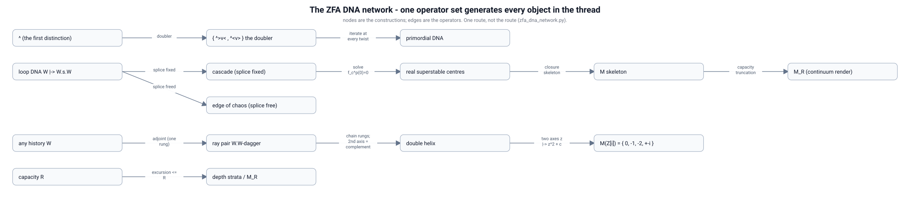

### `Primordial_Entanglement.md`

# The Primordial Entanglement: The A Priori Generation of Particles

In the Quantum Logical Framework (QLF), the universe did not begin with a singularity of infinite mass. It began with a single computational distinction. Because the universal manifold must always sum to the Identity (The Void, or Zero Free Action), "Creation" is strictly defined as the separation of nothing into two perfect, entangled conjugates. 

From this single initial distinction, **all possible logical systems and physical particles are generated a priori** as the computational engine attempts to close the open topology.

## 1. The Seed: The `^>` and `^<` Distinction
Before space, time, or mass existed, the computational manifold executed a single, symmetric logical split. To maintain horizontal ZFA while generating temporal action (represented by the `^` axis), the engine branched into two entangled perspectives:

* **Perspective A:** `^>` (Evolves Up and Right / Forward-Time, Right-Handed bias)
* **Perspective B:** `^<` (Evolves Up and Left / Backward-Time, Left-Handed bias)

This is the primordial entangled pair.

## 2. The Axiom of Closure: Generating "Particles"
The engine is strictly constrained by the requirement to achieve global Zero Free Action (ZFA). Because `^>` and `^<` are open strings, they must evolve to cancel their topological deficits. 

A "particle" in QLF is simply an **Unforgeable Name** given to a history string that has successfully folded back onto itself to achieve ZFA. Therefore, the catalog of all possible particles in the universe is simply the exhaustive, a priori combinatoric set of all possible ways to close the `^>` and `^<` strings.

## 3. The A Priori Logical Systems

By iterating the QuCalc Pauli-permitted branches, the engine systematically discovers the following logical systems. This hierarchy forms the "Periodic Table" of the Possibilist Universe.

### System 1: The Fundamental Loops (Base Fermions)
The fastest computational route to ZFA is to immediately execute the exact geometric inverses. 
* Perspective A (`^>`) appends `v<` to close the loop: **`^>v<`** (Right-Handed Particle)
* Perspective B (`^<`) appends `v>` to close the loop: **`^<v>`** (Left-Handed Particle)

These $N=4$ length loops are the smallest possible stable boundaries in the QuCalc logic. Because their internal Topological Volume (Emergent Energy) is small, they correspond to the lightest stable fermions (e.g., the electron and the positron). 

### System 2: The Resonant Harmonics (Particle Generations)
If the string does not immediately close at $N=4$ due to environmental pressure or causal pruning (The Zeno Effect), it is driven into higher-order resonance to achieve ZFA. 
* **The $N=8$ Loop:** `^^>>vv<<`
* **The $N=12$ Loop:** `^^^>>>vvv<<<`

Because the Emergent Spatial Radius ($R$) is proportional to the history length, these larger loops enclose greater Topological Volume (Energy/Mass). This generates the exact a priori mechanism for the **Generations of Matter** (e.g., the Muon and the Tau). They are structurally identical to the electron, but are stabilized at higher harmonic limits of the primordial `^>` / `^<` topology.

### System 3: The Knotted Manifolds (Quarks & Bosons)
If the primordial strings interact with the local/temporal gauge axes (`+`, `-`, `/`, `\`), they generate complex topological knots that cannot close independently. 

* **Open-Ended Connectors (Bosons):** Strings that execute pure straight-line logic (e.g., `^^^^`) to satisfy a Joint ZFA between two distant, disconnected loops. They possess no internal volume (Mass = 0) and act purely as relational Prefixes.
* **Fractional ZFA (Quarks):** Strings that only achieve partial topological closure (e.g., balancing 2 of the 3 active dimensions). Because they leak free action, they cannot exist as isolated Unforgeable Names. They must group in pairs or triplets (Mesons and Baryons) to form a shared, stable Macroscopic Context (e.g., a Proton).

### System 4: The Information Ecology (Macroscopic Asymmetry)
As these stable loops accumulate, they generate the **Information Ecology**—the dense vacuum of space. 
Because an observer made of matter is constructed entirely from the descendants of the `^>` (Right-Handed, Forward-Time) perspective, the local ecology appears massively asymmetric. 

To survive in an ecology dominated by Right-Handed loops, complex particles must form **Chiral Traps**. Atoms are highly complex, nested ZFA systems that utilize Left-Handed internal logic (`^<v>`) to perfectly cancel the external Right-Handed pressure of the `^>` vacuum.

## 4. Conclusion
Physics is not empirical; it is strictly deductive. Standard model parameters (mass ratios, charges, spin, and chiral asymmetry) do not need to be measured; they can be calculated. The entire universe is the deterministic, a priori output of the computational engine attempting to close the original `^>` and `^<` entanglement back to Zero.

**Demonstration** 

This section shows the current terminal output a user would see when running a script like `particles.py` to calculate the Big Bang from scratch. It proves that the "Logical Bang" isn't just a philosophy; it is a computable algorithm.

***

## 5. Computational Demonstration: The Logical Bang

The theoretical generation of particles can be directly simulated using the computational engine in this repository. By running the `particles.py` module, we can watch the QuCalc engine attempt to resolve the primordial divergence in real-time.

When we seed the engine with the primordial split (`^>` and `^<`) and allow it to expand its logical light cone, it systematically searches the Pauli-permitted possibility space for combinations that achieve global Zero Free Action (ZFA).

### Execution: Resolving the Primordial Split

Running the engine to a logical depth of $N=4$ simulates the first moments of the "Logical Bang":

```bash
$ python particles.py --seed "primordial" --max_depth 4
```

**Terminal Output:**
```text
======================================================
[QLF ENGINE] INITIATING THE LOGICAL BANG
======================================================
Time (t=0) : Void State (Identity)
Time (t=1) : Primordial Divergence Detected.
  -> Perspective A Seed : '^>' (Forward-Time, Right-Bias)
  -> Perspective B Seed : '^<' (Backward-Time, Left-Bias)

[Expanding Causal Horizons...]
Depth 2 : 2 open paths.  Valid ZFA Closures: 0
Depth 3 : 8 open paths.  Valid ZFA Closures: 0
Depth 4 : 32 open paths. Valid ZFA Closures: 2

======================================================
⚠️ MACROSCOPIC CLOSURE DETECTED (t=4) ⚠️
The following Unforgeable Names have been generated:
======================================================

[Particle System 01]
  Origin Seed       : ^>
  Resolved Topology : ^>v<
  Handedness        : Right-Handed Loop
  Emergent Mass (R) : 4
  Status            : STABLE (Base Fermion A)

[Particle System 02]
  Origin Seed       : ^<
  Resolved Topology : ^<v>
  Handedness        : Left-Handed Loop
  Emergent Mass (R) : 4
  Status            : STABLE (Base Fermion B)

------------------------------------------------------
Global Action Verification : (^>v<) + (^<v>) = 0 (Void)
======================================================
```

### Analysis of the Output
1. **The Absence of Magic:** The script did not use any random numbers, mass parameters, or gravitational constants. It simply advanced the logic.
2. **The Generation of Mass:** At $t=2$ and $t=3$, no particles existed. The logic was still "open" (Free Action). At $t=4$, the combinatoric engine discovered the first geometric closures. Space and Mass ($R=4$) officially emerged. 
3. **Perfect Symmetry:** The output proves the global universe remains perfectly symmetric. Perspective A generated a Right-Handed base fermion, and Perspective B generated a Left-Handed base fermion. The total net action of the universe remains exactly Zero.

By increasing the `--max_depth` parameter in `particles.py` to 8 or 12, the engine will automatically discover the higher-order resonant harmonics (Muons, Taus) and the fractional knots (Quarks) required to stabilize the expanding Information Ecology.

## 6. The Primordial DNA: The Same Split, Iterated

The split of §1, closed into the System 1 loops, is a single event. Read as a
**replication rule** instead, and it generates the whole hierarchy: replace every twist
by the closure headed by it, in either chirality.

| twist | electron chirality | positron chirality |
|---|---|---|
| `^` | `^>v<` | `^<v>` |
| `>` | `>v<^` | `>^<v` |
| `v` | `v<^>` | `v>^<` |
| `<` | `<^>v` | `<v>^` |

Seed `^`; the choice is free at every twist of every generation (the `|` is RhoQuCalc's
parallel bar). Every block is itself a closure, so each generation is a concatenation of
closures and three things hold **together**, in every realization (`primordial_zfa_dna.py`,
each one checked, not asserted):

* **Closure at every depth.** ZFA at every generation, with maximum excursion 2 — heard
  at every capacity horizon. Depth costs nothing.
* **Exact self-similarity.** Keep every 4th twist (the block heads) and the parent
  generation returns exactly. Every block has zero counts, so a tally of the child sees
  nothing of the parent: the coarse scale is carried entirely in the *order* of the
  twists, the one place ZFA does not charge for.
* **Chaos.** Generation $k$ has length $4^k$ and $N_k = 2^{(4^k-1)/3}$ distinct
  histories, so the entropy is $1/3$ bit per twist. Positive entropy with no metric, no
  parameter and no noise source — possibilist chaos in the strict sense.

The same free bit, three ways: the primordial split (`^` into matter / antimatter), the
minimal doubler (`doubler.py`), and this generator. Determinism is the fixed-choice
special case: all-electron chirality is a single self-similar fixed point, the 2-axis
cousin of the Thue–Morse genome.

**Contrast with the loop DNA.** `mandelbrot_loop_dna.py` writes the quadratic loop
$z \mapsto z^2 + c$ on the same conjugate pair: squaring is concatenation and $+c$ is
one splice twist, so its DNA is $W \mapsto W \cdot s \cdot W$. The free-action debt
grows as $2^k/3$, so a capacity-$R$ listener hears it only to depth
$K(R) = \log_2(3R)$ — the finite depth at which the Mandelbrot set exists. Freeing the
splice buys only $O(\log n)$ bits in $n$ twists, i.e. zero per twist: that genome is
the deterministic edge of chaos, not chaos per twist. Chaos per twist needs the free bit
at the density of closures — one per closure rather than one per doubling — which is
this section's DNA.

Scope: no physical identification of these generations is claimed; closure is by
construction (concatenated closures), and $1/3$ is the generation entropy, not the
factor complexity of the full infinite language.

## 7. Chaos Emergence, and the Mandelbrot Set Generated by Closure

**Chaos is free order at positive density.** The loop DNA of §6 copies a word and joins the copies with one splice twist, $W \mapsto W \cdot s \cdot W$. Fix the splice and the genome is deterministic — one word per depth, the edge of chaos. Free it and each doubling carries a free bit, but the length doubles with it, so $h \to 0$ per twist: a free bit per *doubling* is $O(\log n)$ bits in $n$ twists — total information growing while density vanishes. Put the free bit at the density of *closures* instead — the §6 DNA, one chirality per closure — and $h \to 1/3$. The active-inference reading ([`Active_Inference_Mathematics.md`](Active_Inference_Mathematics.md) §3, `active_inference_vfe_demo.py`) makes this exact: every closure event is the 50/50 partition carrying $D_{KL} = \log 2$, so $h$ per twist *is* the density of free distinctions, and chaos emerges the moment that density is positive. `chaos_emergence.py` computes the spectrum:

| mechanism | free distinctions | twists | $h$ (bits/twist) |
|---|---|---|---|
| cascade, splice fixed | $0$ | $2^{k+1}-1$ | $0$ |
| free splice, once per doubling | $k$ | $2^{k+1}-1$ | $\to 0$ |
| **primordial DNA, one per closure** | $(4^k-1)/3$ | $4^k$ | $1/3$ |
| unconstrained census | $\log_2 C(2m,m)$ | $2m$ | $\to 1$ |

The simplest positive value the twist algebra offers is $1/3$ — one free chirality per closure, at every scale at once. The free bit is real order, not a rounding artefact: flipping a block's chirality changes no count and no closure status, only the history.

**The Mandelbrot set, generated by closure, one way.** The §6 loop DNA already carries the quadratic loop: squaring $z \mapsto z^2$ is the itinerary copied and $+c$ is one splice twist. An agent integrates only the closures it can complete inside its capacity $R$ — a state outside $|z| \le 2$ is not a closure it can hold — so its set is

$$M_R = \{\, c : \text{the critical orbit has not escaped in } R \text{ steps} \,\}, \qquad M = \bigcap_R M_R .$$

The finite-capacity set is the object; the limit is its rendering ([`Continuum_Choice_Fallacy.md`](Continuum_Choice_Fallacy.md)). The set's *skeleton* is where the critical loop closes exactly, $f_c^p(0) = 0$ — a finite computation whose periods reproduce the period-doubling cascade $2^k$ that the loop DNA generates, plus the windows (period 3 at $c \approx -1.7549$). `mandelbrot_logical.py` checks that the cascade centres are generated by the DNA and renders $M_R$ in one way.

The method is [`QucalcSearch.md`](QucalcSearch.md)'s: of the ways a position can close, take the one closure the substrate takes — the least free action, the shallowest-horizon closure, the one reachable the most ways (`QLF_ClosureDepthLaw`, and `/solve`). Rather than enumerate all ways, find the simplest path; any way at all is a result that happens in finite time.

Scope: one construction, not the route. Only one conjugate pair is used; the full 2D set as a purely combinatorial object needs the second axis, which §8 proposes (the complementary history) and settles exactly on the Gaussian integers. No Feigenbaum delta is computed or needed.

## 8. The Second Axis Is the Complementary History: the Double Helix

`mandelbrot_logical.py` leaves the full 2D set open for want of a second axis. The second axis is the **complementary history** — the Hermitian adjoint $W^\dagger$ — and it is what makes the ZFA DNA a double helix.

**The rung.** The adjoint reverses a word and flips each twist, so $W$ and $W^\dagger$ are antiparallel and complementary, and $W \cdot W^\dagger$ closes: count-balanced *and* Pauli-closed, a scalar — the "ray pair" of `mandelbrot_loop_dna.py` §4. One rung is one closure; a chain of rungs is the helix; each base pair carries $\log 2$.

**The identification.** On the Pauli fold the adjoint is complex conjugation, $\mathrm{fold}(W^\dagger) = (-1)^{|W|}\,\mathrm{fold}(W)^\dagger$ — the sign is global and vanishes for the even-length words that close (`double_helix_dna.py` §0 checks it; `twist_core.adjoint_history` now records it). So a history and its complement form a complex pair $(A+iB,\ A-iB)$: $A$, the self-adjoint part, is the rung (what the strands agree on); the $iB$ direction, anti-self-adjoint, is the second axis (what they disagree on). The second axis is not another space direction — it is the strand difference.

**The DNA.** With two axes the map is $z \mapsto z^2 + c$ (squaring reproduces both strands, $+c$ splices a rung) on $z = x + iy$, and the bounded-orbit set is the Mandelbrot set of the helix. Exactly, on the Gaussian integers, it is finite: the escape lemma bounds every bounded $c$ by $|c| \le 2$, leaving thirteen candidates, of which

$$M(\mathbb{Z}[i]) = \{\, 0,\ -1,\ -2,\ +i,\ -i \,\}$$

survive. It contains the conjugate pair $\pm i$ — the two strands again — and the real parameters of the critical point, its 2-cycle, and the parabolic fixed point. Rendered on the continuum, this is the familiar set.

Scope: a route, not the route — the algebra has other conjugate pairs (x, y, z axes). The exact finite set is the object; the picture is its rendering.

## 9. The Network of What We Discovered

The objects of §6–§8 are not unrelated. `zfa_dna_network.py` measures the intersections three ways:

- **Elements.** As sets of closures inside the ZFA census they form a chain, $\text{primordial} \subset \text{doubler table} \subset (\text{length-4 census})$, with the electron/positron pair $\{\texttt{^>v<}, \texttt{^<v>}\}$ the hub shared by two constructions; jointly they cover only ~5% of the length-4 census. They intersect, thinly — genuinely different objects with a small common core.
- **Parameters.** A two-point hub $\{0, -1\}$ — the critical fixed point and the period-2 superstable centre — is shared by the cascade skeleton and the exact $M(\mathbb{Z}[i])$; $-2$ is in $M(\mathbb{Z}[i])$ but is not a superstable centre, and $\pm i$ are conjugate.
- **Operators.** Four operators — the doubler, the adjoint/closure, the free splice, and the capacity listener — generate every object in the thread from the seeds $\texttt{^}$ and $W \mapsto W \cdot s \cdot W$. This is the dense network, and it is the sense in which the sets "intersect in a ZFA DNA network": they share operators, not elements.

Byproduct, recorded because it changes a count: the census here uses the canonical `twist_core.is_zfa` and has **168** four-twist closures. `active_inference_vfe_demo.py` had used a weaker sign-parity balance (pooling the four axes' signs) and reported 384; it is corrected to 168, and the two docs that cited 384 are updated.

The operator network as a figure (the main chains; the full operator list, including free-splice → primordial DNA, is in the text report). Regenerate with `python3 zfa_dna_network.py --svg`, or the same graph as Graphviz with `--dot`:

<p align="center"></p>

## 10. Enough to Generate It — and Exactly

"Do we have enough to do the Mandelbrot set generation any way?" Measured answer: **yes**, and there are now four generations on record.

| generation | engine | what it gives |
|---|---|---|
| capacity-`R` escape (`mandelbrot_logical.py`) | float complex | `M_R → M`; the skeleton `f_c^p(0)=0` exact |
| two-axis, Gaussian integers (`double_helix_dna.py`) | exact integer | `M(Z[i]) = {0,-1,-2,±i}` |
| dyadic (`mandelbrot_exact.py`) | **exact integer, no float** | `M_R` on the grid `1/2^q`, certified |
| word-only / combinatorial | — | **not ready** (below) |

`mandelbrot_exact.py` runs the whole generation in `int`: the state is a Gaussian rational `(A+iB)/2^d`, squaring and the `+c` splice stay on the dyadic grid, and escape is the exact comparison `A²+B² > 4·2^{2d}`. It agrees with the float render on every cell except a handful where the orbit passes within a rounding of `|z| = 2` — and there the exact value is the truth. On a `1/2⁴` grid it renders the set and counts `M_R` falling `1386 → 473` cells as `R` grows `2 → 16`, toward `area(M)`. This honours the repo's rule *exact arithmetic before float* ([`ScientificApproach.md`](ScientificApproach.md)).

**The one route that is not ready** is a generation from twist *words* alone — no arithmetic at all. That would go through kneading/lamination theory, and a naive parity-lex admissibility rule does not work: it yields `2, 3, 4, 6, 10, 17` periodic words for periods `1–6`, where the real hyperbolic-component counts are `1, 1, 1, 2, 3, 5`. So the word-only route is a genuine open problem, not a switch to flip.

Scope: finite capacity and a dyadic grid; exact; one route, not the route.

See also: [Entanglement.md](Entanglement.md) — unified synthesis treating this primordial pair-creation as the cosmological origin of all entanglement (§2); [Annihilation.md](Annihilation.md) — the reverse Hermitian-pair event that returns the action to the Void.
