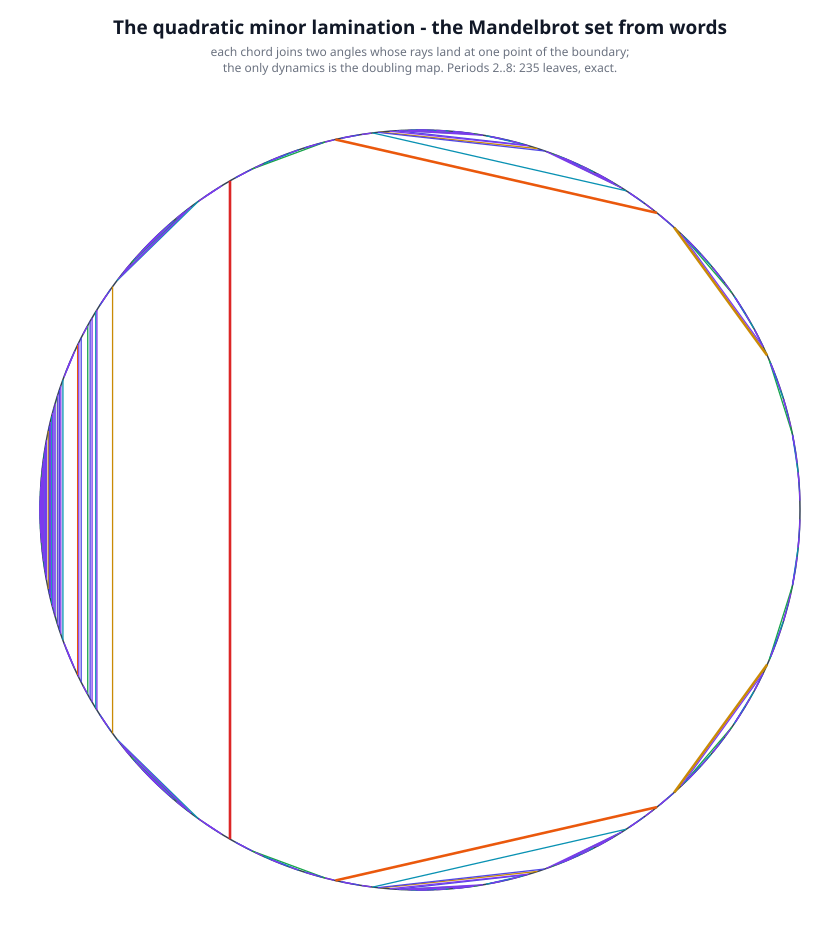

### `ZFA_DNA.md`

# ZFA DNA, and the Mandelbrot Set Generated From It

*The twist algebra of the [Quantum Logical Framework](README.md) (QLF), read as a replication rule, generates a whole hierarchy — and that hierarchy generates the Mandelbrot set. This document is that thread, standalone: the substrate, the DNA rule, the chaos it produces, the second axis that makes it two-dimensional, the operator network, and three generations of the set itself.*

## 0. The substrate, in one table

QLF's primitive is an **8-twist alphabet** — four axes, each with two signs, folding onto the
Pauli matrices ([`twist_core.py`](twist_core.py), [`QuCalc.md`](QuCalc.md)):

| twists | Pauli | axis |
|---|---|---|
| `>`, `<` | `+σ_x`, `−σ_x` | x |
| `^`, `v` | `+σ_y`, `−σ_y` | y |
| `/`, `\` | `+σ_z`, `−σ_z` | z |
| `+`, `−` | `+I`, `−I` | gauge (no axis) |

A history is a word over this alphabet. It is a **closure** — a "particle", an Unforgeable Name —
when it achieves **Zero Free Action**: every axis' counts balance *and* the Pauli fold is a scalar
(`twist_core.is_zfa`, `twist_core.pauli_fold`). That is the entire substrate used below.

**Run it.** The reference implementation is [`qucalc_search.py`](qucalc_search.py), the "what
closes next" query of [`QucalcSearch.md`](QucalcSearch.md):

```bash
$ python3 qucalc_search.py "^>v" --max-depth 4
22 closures from ['^>v'] within 4 twists in 0.001s

$ python3 qucalc_search.py "^>v" --solve          # the one closure the substrate takes
{ "solved": true, "cont": "<", "history": "^>v<", "depth": 1, "phase": "-1",
  "peak_excursion": 2, "arrangements": 6, "considered": 14, ... }
```

`^>v` closes in one twist to `^>v<` — the electron loop of §1 — and the closure the substrate
itself takes is the shallowest one, at peak excursion `2`. That `2` is exactly the excursion the
DNA of §1 holds at every depth, which is why the DNA is a closure-generator and not a random walk.

The scripts of this thread: [`primordial_zfa_dna.py`](primordial_zfa_dna.py),
[`chaos_emergence.py`](chaos_emergence.py), [`mandelbrot_loop_dna.py`](mandelbrot_loop_dna.py),
[`mandelbrot_logical.py`](mandelbrot_logical.py), [`double_helix_dna.py`](double_helix_dna.py),
[`mandelbrot_exact.py`](mandelbrot_exact.py),
[`mandelbrot_lamination.py`](mandelbrot_lamination.py),
[`zfa_dna_network.py`](zfa_dna_network.py). Each checks what it asserts; running any of them
prints its own validation.

---

## 1. The DNA rule

The primordial split ([`Primordial_Entanglement.md`](Primordial_Entanglement.md) §1), closed into
the System 1 loops, is a single event. Read as a **replication rule** instead, it generates the
whole hierarchy: replace every twist by the closure headed by it, in either chirality.

| twist | electron chirality | positron chirality |
|---|---|---|
| `^` | `^>v<` | `^<v>` |
| `>` | `>v<^` | `>^<v` |
| `v` | `v<^>` | `v>^<` |
| `<` | `<^>v` | `<v>^` |

Seed `^`; the choice is free at every twist of every generation (the `|` is RhoQuCalc's parallel
bar, [`BraKetRhoQuCalc.md`](BraKetRhoQuCalc.md)). Every block is itself a closure, so each
generation is a concatenation of closures and three things hold **together**, in every realization
([`primordial_zfa_dna.py`](primordial_zfa_dna.py), each one checked, not asserted):

* **Closure at every depth.** ZFA at every generation, with maximum excursion 2 — heard at every
  capacity horizon. Depth costs nothing.
* **Exact self-similarity.** Keep every 4th twist (the block heads) and the parent generation
  returns exactly. Every block has zero counts, so a tally of the child sees nothing of the parent:
  the coarse scale is carried entirely in the *order* of the twists, the one place ZFA does not
  charge for.
* **Chaos.** Generation $k$ has length $4^k$ and $N_k = 2^{(4^k-1)/3}$ distinct histories, so the
  entropy is $1/3$ bit per twist. Positive entropy with no metric, no parameter and no noise source
  — possibilist chaos in the strict sense.

The same free bit, three ways: the primordial split (`^` into matter / antimatter), the minimal
doubler (`doubler.py`), and this generator. Determinism is the fixed-choice special case: the
all-electron chirality is a single self-similar fixed point, the 2-axis cousin of the Thue–Morse
genome.

Scope: no physical identification of these generations is claimed; closure is by construction
(concatenated closures), and $1/3$ is the generation entropy, not the factor complexity of the
full infinite language.

---

## 2. Chaos emergence: where the $1/3$ comes from

**Chaos is free order at positive density.** The loop DNA of §3 copies a word and joins the copies
with one splice twist, $W \mapsto W \cdot s \cdot W$. Fix the splice and the genome is
deterministic — one word per depth, the edge of chaos. Free it and each doubling carries a free
bit, but the length doubles with it, so the density goes to zero: a free bit per *doubling* is
$O(\log n)$ bits in $n$ twists. Put the free bit at the density of *closures* instead — the §1 DNA,
one chirality per closure — and the entropy is $1/3$ per twist. The active-inference reading
([`Active_Inference_Mathematics.md`](Active_Inference_Mathematics.md) §3,
[`active_inference_vfe_demo.py`](active_inference_vfe_demo.py)) makes this exact: every closure
event is the 50/50 partition carrying $D_{KL} = \log 2$, so $h$ per twist *is* the density of free
distinctions, and chaos emerges the moment that density is positive.
[`chaos_emergence.py`](chaos_emergence.py) computes the spectrum:

| mechanism | free distinctions | twists | $h$ (bits/twist) |
|---|---|---|---|
| cascade, splice fixed | $0$ | $2^{k+1}-1$ | $0$ |
| free splice, once per doubling | $k$ | $2^{k+1}-1$ | $\to 0$ |
| **primordial DNA, one per closure** | $(4^k-1)/3$ | $4^k$ | $1/3$ |
| unconstrained census | $\log_2 C(2m,m)$ | $2m$ | $\to 1$ |

The simplest positive value the twist algebra offers is $1/3$ — one free chirality per closure, at
every scale at once. The free bit is real order, not a rounding artefact: flipping a block's
chirality changes no count and no closure status, only the history.

---

## 3. The loop DNA: $W \mapsto W \cdot s \cdot W$

[`mandelbrot_loop_dna.py`](mandelbrot_loop_dna.py) writes the quadratic loop $z \mapsto z^2 + c$ on
one conjugate pair: squaring is concatenation and $+c$ is one splice twist, so its DNA is
$W \mapsto W \cdot s \cdot W$. The free-action debt grows as $2^k/3$, so a capacity-$R$ listener
hears it only to depth $K(R) = \log_2(3R)$ — the finite depth at which the Mandelbrot set exists.
Freeing the splice buys only $O(\log n)$ bits in $n$ twists, i.e. zero per twist: that genome sits
at the deterministic edge of chaos, not chaos per twist.

---

## 4. The set generated by closure, one way

An agent integrates only the closures it can complete inside its capacity $R$ — a state outside
$|z| \le 2$ is not a closure it can hold — so its set is

$$M_R = \{\, c : \text{the critical orbit has not escaped in } R \text{ steps} \,\}, \qquad M = \bigcap_R M_R .$$

The finite-capacity set is the object; the limit is its rendering
([`Continuum_Choice_Fallacy.md`](Continuum_Choice_Fallacy.md)). The set's *skeleton* is where the
critical loop closes exactly, $f_c^p(0) = 0$ — a finite computation whose periods reproduce the
period-doubling cascade $2^k$ that the loop DNA generates, plus the windows (period 3 at
$c \approx -1.7549$). [`mandelbrot_logical.py`](mandelbrot_logical.py) checks that the cascade
centres are generated by the DNA and renders $M_R$ in one way.

The method is [`QucalcSearch.md`](QucalcSearch.md)'s, and it is the same `/solve` shown in §0: of
the ways a position can close, take the closure the substrate takes — the least free action, the
shallowest-horizon closure, the one reachable the most ways (`QLF_ClosureDepthLaw`, and `/solve`).
Rather than enumerate all ways, find the simplest path; any way at all is a result that happens in
finite time.

```bash
$ python3 mandelbrot_logical.py      # cascade centres from the DNA, and M_R rendered one way
```

Scope: one construction, not the route. Only one conjugate pair is used; the full 2D set as a
purely combinatorial object needs the second axis, which §5 supplies.

---

## 5. The second axis is the complementary history: the double helix

[`mandelbrot_logical.py`](mandelbrot_logical.py) leaves the full 2D set open for want of a second
axis. The second axis is the **complementary history** — the Hermitian adjoint $W^\dagger$ — and it
is what makes the ZFA DNA a double helix.

**The rung.** The adjoint reverses a word and flips each twist, so $W$ and $W^\dagger$ are
antiparallel and complementary, and $W \cdot W^\dagger$ closes: count-balanced *and* Pauli-closed,
a scalar — the "ray pair" of `mandelbrot_loop_dna.py` §4. One rung is one closure; a chain of rungs
is the helix; each base pair carries $\log 2$.

**The identification.** On the Pauli fold the adjoint is complex conjugation,
$\mathrm{fold}(W^\dagger) = (-1)^{|W|}\,\mathrm{fold}(W)^\dagger$ — the sign is global and vanishes
for the even-length words that close ([`double_helix_dna.py`](double_helix_dna.py) §0 checks it;
`twist_core.adjoint_history` records it). So a history and its complement form a complex pair
$(A+iB,\ A-iB)$: $A$, the self-adjoint part, is the rung (what the strands agree on); the $iB$
direction, anti-self-adjoint, is the second axis (what they disagree on). The second axis is not
another space direction — it is the strand difference.

**The DNA.** With two axes the map is $z \mapsto z^2 + c$ (squaring reproduces both strands, $+c$
splices a rung) on $z = x + iy$, and the bounded-orbit set is the Mandelbrot set of the helix.
Exactly, on the Gaussian integers, it is finite: the escape lemma bounds every bounded $c$ by
$|c| \le 2$, leaving thirteen candidates, of which

$$M(\mathbb{Z}[i]) = \{\, 0,\ -1,\ -2,\ +i,\ -i \,\}$$

survive. It contains the conjugate pair $\pm i$ — the two strands again — and the real parameters of
the critical point, its 2-cycle, and the parabolic fixed point. Rendered on the continuum, this is
the familiar set.

Scope: a route, not the route — the algebra has other conjugate pairs (the x, y, z axes of §0). The
exact finite set is the object; the picture is its rendering.

---

## 6. The operator network

The objects of §1–§5 are not unrelated. [`zfa_dna_network.py`](zfa_dna_network.py) measures the
intersections three ways:

* **Elements.** As sets of closures inside the ZFA census they form a chain,
  $\text{primordial} \subset \text{doubler table} \subset (\text{length-4 census})$, with the
  electron/positron pair `^>v<` / `^<v>` the hub shared by two constructions; jointly they cover
  only ~5% of the length-4 census. They intersect, thinly — genuinely different objects with a
  small common core.
* **Parameters.** A two-point hub $\{0, -1\}$ — the critical fixed point and the period-2
  superstable centre — is shared by the cascade skeleton and the exact $M(\mathbb{Z}[i])$; $-2$ is
  in $M(\mathbb{Z}[i])$ but is not a superstable centre, and $\pm i$ are conjugate.
* **Operators.** Four operators — the doubler, the adjoint/closure, the free splice, and the
  capacity listener — generate every object in the thread from the seeds `^` and
  $W \mapsto W \cdot s \cdot W$. This is the dense network, and it is the sense in which the sets
  "intersect in a ZFA DNA network": they share operators, not elements.

The census uses the canonical `twist_core.is_zfa` and has **168** four-twist closures. This is the
count the operator claim rests on, so it is stated rather than implied.

The operator network as a figure (the main chains; the full operator list, including
free-splice → primordial DNA, is in the text report). Regenerate with
`python3 zfa_dna_network.py --svg`, or the same graph as Graphviz with `--dot`:

<p align="center"></p>

---

## 7. Generating the set exactly — no float

[`mandelbrot_logical.py`](mandelbrot_logical.py) renders $M_R$ with float complex arithmetic.
[`mandelbrot_exact.py`](mandelbrot_exact.py) does the same generation entirely in Python `int`: the
state is a Gaussian rational $(A+iB)/2^d$, squaring and the $+c$ splice stay on the dyadic grid, and
escape is the exact comparison $A^2 + B^2 > 4 \cdot 2^{2d}$. This honours the repository's rule
*exact arithmetic before float* ([`ScientificApproach.md`](ScientificApproach.md)).

It agrees with the float render on every cell except a handful where the orbit passes within a
rounding of $|z| = 2$ — and there the exact value is the truth. On a $1/2^4$ grid the count falls as
capacity grows, toward $\mathrm{area}(M)$:

| $R$ | cells of $M_R$ (of 1628) | fraction |
|---|---|---|
| 2 | 1386 | 0.851 |
| 4 | 841 | 0.517 |
| 8 | 568 | 0.349 |
| 12 | 499 | 0.307 |
| 16 | 473 | 0.291 |

With $q = 0$ the same engine runs on the Gaussian integers and reproduces $M(\mathbb{Z}[i])$ of §5 —
one engine, two regimes.

```bash
$ python3 mandelbrot_exact.py        # ~10 s: the table above, plus the exact render
```

Scope: finite capacity and a dyadic grid; exact; one route, not the route.

---

## 8. Generating the set from words alone: the quadratic minor lamination

The generation that uses no arithmetic at all is the **quadratic minor lamination** (Douady–Hubbard
/ Thurston): chords of the circle joining two angles whose external rays land at the same point of
$\partial M$. Its gaps are the hyperbolic components of $M$, and its quotient is the combinatorial
model of $M$.

**How.** The only dynamics is the doubling map $D(t) = 2t \bmod 1$ — the same "the itinerary is
copied" law as the loop DNA of §3 — acting on the angles $k/(2^n - 1)$, in `Fraction`, with no float
and no escape test. Leaves are added by increasing period: for every **gap** of the lamination so
far, take the exact-period-$n$ angles on that gap's boundary, in boundary order, and pair them
consecutively.

**Validation.** Every angle of exact period $n$ is the root line of exactly one hyperbolic component
of period $n$, so the number of leaves of period $n$ must be half the number of exact-period-$n$
angles — the component count of OEIS A000740. [`mandelbrot_lamination.py`](mandelbrot_lamination.py)
hits it at every period:

| period $n$ | leaves | required (OEIS A000740) |
|---|---|---|
| 2 | 1 | 1 |
| 3 | 3 | 3 |
| 4 | 6 | 6 |
| 5 | 15 | 15 |
| 6 | 27 | 27 |
| 7 | 63 | 63 |
| 8 | 120 | 120 |
| 9 | 252 | 252 |
| 10 | 495 | 495 |
| 11 | 1023 | 1023 |
| 12 | 2010 | 2010 |

Three independent facts hold:

* the leaf count per period is exactly the required count, at every period tested (through 12);
* no two leaves cross — 0 crossings among `4015` leaves at period 12, the defining property of a
  lamination;
* the known low-period leaves are reproduced exactly: `(1/3,2/3)`, `(1/7,2/7)`, `(3/7,4/7)`,
  `(5/7,6/7)`, `(1/15,2/15)`, `(13/15,14/15)`, and all six period-4 leaves derived independently by
  hand — including `(2/5,3/5)`, the pair that spans two arcs.

```bash
$ python3 mandelbrot_lamination.py 12       # the table above, in ~30 s
$ python3 mandelbrot_lamination.py --svg 8  # the figure below (235 leaves)
```

The lamination drawn out (colour is period; the large empty region is the main cardioid gap):

<p align="center"></p>

**Not claimed.** Individual high-period leaves were not compared against a published list: the
validation is structural (count + non-crossing + known low periods). And this is the *lamination*,
whose quotient is the combinatorial model of $M$ — not a picture of $M$.
[`mandelbrot_exact.py`](mandelbrot_exact.py) remains the exact numeric route.

---

## 9. Relation to quark colour — and where this thread stops

The three Pauli axes of §0 are, in QLF, **the three colour axes**: `axOf` maps `<>` → x, `^v` → y,
`/\` → z, so R/G/B = (x, y, z) ([`Quarks.md`](Quarks.md) §1; `QLF_BaryonWinding`,
`QLF_QuarkStructure`). The strong `SU(3)` is the traceless 3-axis directional tensor, its eight
gluons the connectors between colour axes, and a baryon needs a twist on *every* axis — the
Borromean three-colour necessity, `baryon_needs_all_three_axes`. The whole gauge reading of the
same axes is [`Forces_From_Three_Axes.md`](Forces_From_Three_Axes.md).

So the relation is exact, and so is its boundary. The DNA of §1 lives on **one** conjugate pair —
the `>`, `<` axis — and the double helix of §5 adds the **second** (the complementary history).
Everything in §1–§8 is therefore one-axis and two-axis work. Colour is the *three-axis* statement:
it is proved in [`Quarks.md`](Quarks.md), not here, and this thread does not use it. What this
thread shares with the colour picture is the closure rule: the same axes, and the same ZFA
condition deciding what may exist at all.

---

## References

The substrate (§0), the DNA rule (§1) and the generations (§4, §7) are this repository's. The
mathematics of §8 is not — the quadratic minor lamination is standard, and these are its sources:

* A. Douady & J. H. Hubbard, *Étude dynamique des polynômes quadratiques complexes* (Publications
  Mathématiques d'Orsay, 1984–85) — the external rays of $M$ and their landing on $\partial M$.
* J. Milnor & W. Thurston, *On iterated maps of the interval* (Lecture Notes in Mathematics 1342,
  Springer, 1988) — kneading theory, the admissible itineraries.
* W. P. Thurston, *On the geometry and dynamics of iterated rational maps* (1985; in *Complex
  Dynamics*, A K Peters, 2009) — the lamination as a model of $M$.
* J. Milnor, *Periodic orbits, external rays and the Mandelbrot set* — hyperbolic components and
  the rays landing at their roots.
* D. Schleicher, *The quadratic minor lamination* (in *Complex Dynamics: Families and Friends*,
  A K Peters, 2009) — the lamination and the renormalisation structure.
* J. C. Mayer & L. G. Oversteegen, *A quadratic minor lamination algorithm*, Topology Proceedings
  20 (1995) — generating the lamination from the doubling map.
* OEIS [A000740](https://oeis.org/A000740) — the count of hyperbolic components of period $n$ used
  as the validation oracle in §8.

The correspondence this repository adds is the reading of that dynamics as the twist algebra's
own word-copy rule (§0, §3) — the reason a Mandelbrot object belongs in a QLF document at all.

---

See also: [`Primordial_Entanglement.md`](Primordial_Entanglement.md) — the seed split the DNA rule
iterates, and §3's partial-closure quarks; [`Quarks.md`](Quarks.md) — colour = the three axes,
confinement, singlets; [`Forces_From_Three_Axes.md`](Forces_From_Three_Axes.md) — the gauge reading
of the three axes; [`QuCalc.md`](QuCalc.md) — the language reference;
[`QucalcSearch.md`](QucalcSearch.md) — search and `/solve`; [`BraKetRhoQuCalc.md`](BraKetRhoQuCalc.md)
— the RhoQuCalc notation; [`Active_Inference_Mathematics.md`](Active_Inference_Mathematics.md) — the
50/50 closure event that sets the $1/3$; [`Entanglement.md`](Entanglement.md) — pair-creation as the
origin of entanglement; [`Continuum_Choice_Fallacy.md`](Continuum_Choice_Fallacy.md) — why the
finite-capacity set is the object; [`ScientificApproach.md`](ScientificApproach.md) — exact
arithmetic before float.
