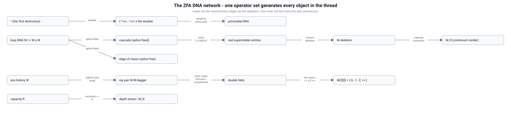
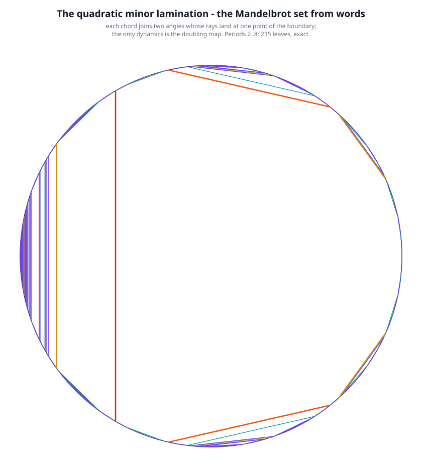
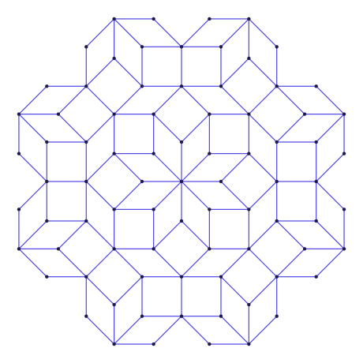
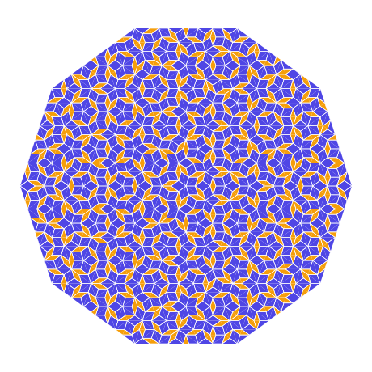

### `ZFA_DNA.md`

# ZFA DNA, and the Mandelbrot Set Generated From It

*The twist algebra of the [Quantum Logical Framework](README.md) (QLF), read as a replication rule, generates a whole hierarchy — and that hierarchy generates the Mandelbrot set. This document is that thread, standalone: the substrate, the DNA rule, the chaos it produces, the second axis that makes it two-dimensional, the operator network, and three generations of the set itself.*

## 0. The substrate, in one table

QLF's primitive is an **8-twist alphabet** — four axes, each with two signs, folding onto the
Pauli matrices ([`twist_core.py`](twist_core.py), [`QuCalc.md`](QuCalc.md)):

| twists | Pauli | axis |
|---|---|---|
| `>`, `<` | `+σ_x`, `−σ_x` | x |
| `^`, `v` | `+σ_y`, `−σ_y` | y |
| `/`, `\` | `+σ_z`, `−σ_z` | z |
| `+`, `−` | `+I`, `−I` | gauge (no axis) |

A history is a word over this alphabet. It is a **closure** — a "particle", an Unforgeable Name —
when it achieves **Zero Free Action**: every axis' counts balance *and* the Pauli fold is a scalar
(`twist_core.is_zfa`, `twist_core.pauli_fold`). That is the entire substrate used below.

**Run it.** The reference implementation is [`qucalc_search.py`](qucalc_search.py), the "what
closes next" query of [`QucalcSearch.md`](QucalcSearch.md):

```bash
$ python3 qucalc_search.py "^>v" --max-depth 4
22 closures from ['^>v'] within 4 twists in 0.001s

$ python3 qucalc_search.py "^>v" --solve          # the one closure the substrate takes
{ "solved": true, "cont": "<", "history": "^>v<", "depth": 1, "phase": "-1",
  "peak_excursion": 2, "arrangements": 6, "considered": 14, ... }
```

`^>v` closes in one twist to `^>v<` — the electron loop of §1 — and the closure the substrate
itself takes is the shallowest one, at peak excursion `2`. That `2` is exactly the excursion the
DNA of §1 holds at every depth, which is why the DNA is a closure-generator and not a random walk.

The scripts of this thread: [`primordial_zfa_dna.py`](primordial_zfa_dna.py),
[`chaos_emergence.py`](chaos_emergence.py), [`mandelbrot_loop_dna.py`](mandelbrot_loop_dna.py),
[`mandelbrot_logical.py`](mandelbrot_logical.py), [`double_helix_dna.py`](double_helix_dna.py),
[`mandelbrot_exact.py`](mandelbrot_exact.py),
[`mandelbrot_lamination.py`](mandelbrot_lamination.py),
[`zfa_dna_network.py`](zfa_dna_network.py). Each checks what it asserts; running any of them
prints its own validation.

---

## 1. The DNA rule

The primordial split ([`Primordial_Entanglement.md`](Primordial_Entanglement.md) §1), closed into
the System 1 loops, is a single event. Read as a **replication rule** instead, it generates the
whole hierarchy: replace every twist by the closure headed by it, in either chirality.

| twist | electron chirality | positron chirality |
|---|---|---|
| `^` | `^>v<` | `^<v>` |
| `>` | `>v<^` | `>^<v` |
| `v` | `v<^>` | `v>^<` |
| `<` | `<^>v` | `<v>^` |

Seed `^`; the choice is free at every twist of every generation (the `|` is RhoQuCalc's parallel
bar, [`BraKetRhoQuCalc.md`](BraKetRhoQuCalc.md)). Every block is itself a closure, so each
generation is a concatenation of closures and three things hold **together**, in every realization
([`primordial_zfa_dna.py`](primordial_zfa_dna.py), each one checked, not asserted):

* **Closure at every depth.** ZFA at every generation, with maximum excursion 2 — heard at every
  capacity horizon. Depth costs nothing.
* **Exact self-similarity.** Keep every 4th twist (the block heads) and the parent generation
  returns exactly. Every block has zero counts, so a tally of the child sees nothing of the parent:
  the coarse scale is carried entirely in the *order* of the twists, the one place ZFA does not
  charge for.
* **Chaos.** Generation $k$ has length $4^k$ and $N_k = 2^{(4^k-1)/3}$ distinct histories, so the
  entropy is $1/3$ bit per twist. Positive entropy with no metric, no parameter and no noise source
  — possibilist chaos in the strict sense.

The same free bit, three ways: the primordial split (`^` into matter / antimatter), the minimal
doubler (`doubler.py`), and this generator. Determinism is the fixed-choice special case: the
all-electron chirality is a single self-similar fixed point, the 2-axis cousin of the Thue–Morse
genome.

Scope: no physical identification of these generations is claimed; closure is by construction
(concatenated closures), and $1/3$ is the generation entropy, not the factor complexity of the
full infinite language.

---

## 2. Chaos emergence: where the $1/3$ comes from

**Chaos is free order at positive density.** The loop DNA of §3 copies a word and joins the copies
with one splice twist, $W \mapsto W \cdot s \cdot W$. Fix the splice and the genome is
deterministic — one word per depth, the edge of chaos. Free it and each doubling carries a free
bit, but the length doubles with it, so the density goes to zero: a free bit per *doubling* is
$O(\log n)$ bits in $n$ twists. Put the free bit at the density of *closures* instead — the §1 DNA,
one chirality per closure — and the entropy is $1/3$ per twist. The active-inference reading
([`Active_Inference_Mathematics.md`](Active_Inference_Mathematics.md) §3,
[`active_inference_vfe_demo.py`](active_inference_vfe_demo.py)) makes this exact: every closure
event is the 50/50 partition carrying $D_{KL} = \log 2$, so $h$ per twist *is* the density of free
distinctions, and chaos emerges the moment that density is positive.
[`chaos_emergence.py`](chaos_emergence.py) computes the spectrum:

| mechanism | free distinctions | twists | $h$ (bits/twist) |
|---|---|---|---|
| cascade, splice fixed | $0$ | $2^{k+1}-1$ | $0$ |
| free splice, once per doubling | $k$ | $2^{k+1}-1$ | $\to 0$ |
| golden DNA, $e \mapsto ep,\ p \mapsto e$ (§11) | $0$ — but never repeats | $4F_{k+2}$ | $0$ |
| **primordial DNA, one per closure** | $(4^k-1)/3$ | $4^k$ | $1/3$ |
| unconstrained census | $\log_2 C(2m,m)$ | $2m$ | $\to 1$ |

The simplest positive value the twist algebra offers is $1/3$ — one free chirality per closure, at
every scale at once. The free bit is real order, not a rounding artefact: flipping a block's
chirality changes no count and no closure status, only the history.

---

## 3. The loop DNA: $W \mapsto W \cdot s \cdot W$

[`mandelbrot_loop_dna.py`](mandelbrot_loop_dna.py) writes the quadratic loop $z \mapsto z^2 + c$ on
one conjugate pair: squaring is concatenation and $+c$ is one splice twist, so its DNA is
$W \mapsto W \cdot s \cdot W$. The free-action debt grows as $2^k/3$, so a capacity-$R$ listener
hears it only to depth $K(R) = \log_2(3R)$ — the finite depth at which the Mandelbrot set exists.
Freeing the splice buys only $O(\log n)$ bits in $n$ twists, i.e. zero per twist: that genome sits
at the deterministic edge of chaos, not chaos per twist.

---

## 4. The set generated by closure, one way

An agent integrates only the closures it can complete inside its capacity $R$ — a state outside
$|z| \le 2$ is not a closure it can hold — so its set is

$$M_R = \{\, c : \text{the critical orbit has not escaped in } R \text{ steps} \,\}, \qquad M = \bigcap_R M_R .$$

The finite-capacity set is the object; the limit is its rendering
([`Continuum_Choice_Fallacy.md`](Continuum_Choice_Fallacy.md)). The set's *skeleton* is where the
critical loop closes exactly, $f_c^p(0) = 0$ — a finite computation whose periods reproduce the
period-doubling cascade $2^k$ that the loop DNA generates, plus the windows (period 3 at
$c \approx -1.7549$). [`mandelbrot_logical.py`](mandelbrot_logical.py) checks that the cascade
centres are generated by the DNA and renders $M_R$ in one way.

The method is [`QucalcSearch.md`](QucalcSearch.md)'s, and it is the same `/solve` shown in §0: of
the ways a position can close, take the closure the substrate takes — the least free action, the
shallowest-horizon closure, the one reachable the most ways (`QLF_ClosureDepthLaw`, and `/solve`).
Rather than enumerate all ways, find the simplest path; any way at all is a result that happens in
finite time.

```bash
$ python3 mandelbrot_logical.py      # cascade centres from the DNA, and M_R rendered one way
```

Scope: one construction, not the route. Only one conjugate pair is used; the full 2D set as a
purely combinatorial object needs the second axis, which §5 supplies.

---

## 5. The second axis is the complementary history: the double helix

[`mandelbrot_logical.py`](mandelbrot_logical.py) leaves the full 2D set open for want of a second
axis. The second axis is the **complementary history** — the Hermitian adjoint $W^\dagger$ — and it
is what makes the ZFA DNA a double helix.

**The rung.** The adjoint reverses a word and flips each twist, so $W$ and $W^\dagger$ are
antiparallel and complementary, and $W \cdot W^\dagger$ closes: count-balanced *and* Pauli-closed,
a scalar — the "ray pair" of `mandelbrot_loop_dna.py` §4. One rung is one closure; a chain of rungs
is the helix; each base pair carries $\log 2$.

**The identification.** On the Pauli fold the adjoint is complex conjugation,
$\mathrm{fold}(W^\dagger) = (-1)^{|W|}\,\mathrm{fold}(W)^\dagger$ — the sign is global and vanishes
for the even-length words that close ([`double_helix_dna.py`](double_helix_dna.py) §0 checks it;
`twist_core.adjoint_history` records it). So a history and its complement form a complex pair
$(A+iB,\ A-iB)$: $A$, the self-adjoint part, is the rung (what the strands agree on); the $iB$
direction, anti-self-adjoint, is the second axis (what they disagree on). The second axis is not
another space direction — it is the strand difference.

**The DNA.** With two axes the map is $z \mapsto z^2 + c$ (squaring reproduces both strands, $+c$
splices a rung) on $z = x + iy$, and the bounded-orbit set is the Mandelbrot set of the helix.
Exactly, on the Gaussian integers, it is finite: the escape lemma bounds every bounded $c$ by
$|c| \le 2$, leaving thirteen candidates, of which

$$M(\mathbb{Z}[i]) = \{\, 0,\ -1,\ -2,\ +i,\ -i \,\}$$

survive. It contains the conjugate pair $\pm i$ — the two strands again — and the real parameters of
the critical point, its 2-cycle, and the parabolic fixed point. Rendered on the continuum, this is
the familiar set.

Scope: a route, not the route — the algebra has other conjugate pairs (the x, y, z axes of §0). The
exact finite set is the object; the picture is its rendering.

---

## 6. The operator network

The objects of §1–§5 are not unrelated. [`zfa_dna_network.py`](zfa_dna_network.py) measures the
intersections three ways:

* **Elements.** As sets of closures inside the ZFA census they form a chain,
  $\text{primordial} \subset \text{doubler table} \subset (\text{length-4 census})$, with the
  electron/positron pair `^>v<` / `^<v>` the hub shared by two constructions; jointly they cover
  only ~5% of the length-4 census. They intersect, thinly — genuinely different objects with a
  small common core.
* **Parameters.** A two-point hub $\{0, -1\}$ — the critical fixed point and the period-2
  superstable centre — is shared by the cascade skeleton and the exact $M(\mathbb{Z}[i])$; $-2$ is
  in $M(\mathbb{Z}[i])$ but is not a superstable centre, and $\pm i$ are conjugate.
* **Operators.** Four operators — the doubler, the adjoint/closure, the free splice, and the
  capacity listener — generate every object in the thread from the seeds `^` and
  $W \mapsto W \cdot s \cdot W$. This is the dense network, and it is the sense in which the sets
  "intersect in a ZFA DNA network": they share operators, not elements.

The census uses the canonical `twist_core.is_zfa` and has **168** four-twist closures. This is the
count the operator claim rests on, so it is stated rather than implied.

The operator network as a figure (the main chains; the full operator list, including
free-splice → primordial DNA, is in the text report). Regenerate with
`python3 zfa_dna_network.py --svg`, or the same graph as Graphviz with `--dot`:

<p align="center"></p>

---

## 7. Generating the set exactly — no float

[`mandelbrot_logical.py`](mandelbrot_logical.py) renders $M_R$ with float complex arithmetic.
[`mandelbrot_exact.py`](mandelbrot_exact.py) does the same generation entirely in Python `int`: the
state is a Gaussian rational $(A+iB)/2^d$, squaring and the $+c$ splice stay on the dyadic grid, and
escape is the exact comparison $A^2 + B^2 > 4 \cdot 2^{2d}$. This honours the repository's rule
*exact arithmetic before float* ([`ScientificApproach.md`](ScientificApproach.md)).

It agrees with the float render on every cell except a handful where the orbit passes within a
rounding of $|z| = 2$ — and there the exact value is the truth. On a $1/2^4$ grid the count falls as
capacity grows, toward $\mathrm{area}(M)$:

| $R$ | cells of $M_R$ (of 1628) | fraction |
|---|---|---|
| 2 | 1386 | 0.851 |
| 4 | 841 | 0.517 |
| 8 | 568 | 0.349 |
| 12 | 499 | 0.307 |
| 16 | 473 | 0.291 |

With $q = 0$ the same engine runs on the Gaussian integers and reproduces $M(\mathbb{Z}[i])$ of §5 —
one engine, two regimes.

```bash
$ python3 mandelbrot_exact.py        # ~10 s: the table above, plus the exact render
```

Scope: finite capacity and a dyadic grid; exact; one route, not the route.

---

## 8. Generating the set from words alone: the quadratic minor lamination

The generation that uses no arithmetic at all is the **quadratic minor lamination** (Douady–Hubbard
/ Thurston): chords of the circle joining two angles whose external rays land at the same point of
$\partial M$. Its gaps are the hyperbolic components of $M$, and its quotient is the combinatorial
model of $M$.

**How.** The only dynamics is the doubling map $D(t) = 2t \bmod 1$ — the same "the itinerary is
copied" law as the loop DNA of §3 — acting on the angles $k/(2^n - 1)$, in `Fraction`, with no float
and no escape test. Leaves are added by increasing period: for every **gap** of the lamination so
far, take the exact-period-$n$ angles on that gap's boundary, in boundary order, and pair them
consecutively.

**Validation.** Every angle of exact period $n$ is the root line of exactly one hyperbolic component
of period $n$, so the number of leaves of period $n$ must be half the number of exact-period-$n$
angles — the component count of OEIS A000740. [`mandelbrot_lamination.py`](mandelbrot_lamination.py)
hits it at every period:

| period $n$ | leaves | required (OEIS A000740) |
|---|---|---|
| 2 | 1 | 1 |
| 3 | 3 | 3 |
| 4 | 6 | 6 |
| 5 | 15 | 15 |
| 6 | 27 | 27 |
| 7 | 63 | 63 |
| 8 | 120 | 120 |
| 9 | 252 | 252 |
| 10 | 495 | 495 |
| 11 | 1023 | 1023 |
| 12 | 2010 | 2010 |

What each check is worth:

* the leaf count per period is exactly the required count, and no two of the `4015` leaves cross.
  Both are **structural**: pairing consecutive boundary angles inside one gap cannot produce a
  crossing, and gives half the angles whenever each gap holds an even number. They show the
  construction is well formed, not that it is *the* lamination;
* the known low-period leaves are reproduced exactly: `(1/3,2/3)`, `(1/7,2/7)`, `(3/7,4/7)`,
  `(5/7,6/7)`, `(1/15,2/15)`, `(13/15,14/15)`, and all six period-4 leaves derived independently by
  hand — including `(2/5,3/5)`, the pair that spans two arcs;
* **the decisive check: the leaf set is identical to the one Lavaurs' algorithm (1986) draws**, leaf
  for leaf, at every period through 12 (the script runs Lavaurs' rule alongside). So the gap pairing
  is Lavaurs' classical construction in another form — found independently here, agreement checked
  rather than proved — and not a new generation of $M$.

```bash
$ python3 mandelbrot_lamination.py 12       # the table above, in ~30 s
$ python3 mandelbrot_lamination.py --svg 8  # the figure below (235 leaves)
```

The lamination drawn out (colour is period; the large empty region is the main cardioid gap):

<p align="center"></p>

**Not claimed.** Novelty: the generation agrees with Lavaurs' algorithm, so what is this thread's is
the reading (the doubling map as the loop DNA's word-copy law), not the algorithm. And this is the *lamination*,
whose quotient is the combinatorial model of $M$ — not a picture of $M$.
[`mandelbrot_exact.py`](mandelbrot_exact.py) remains the exact numeric route.

---

## 9. Relation to quark colour — and where this thread stops

The three Pauli axes of §0 are, in QLF, **the three colour axes**: `axOf` maps `<>` → x, `^v` → y,
`/\` → z, so R/G/B = (x, y, z) ([`Quarks.md`](Quarks.md) §1; `QLF_BaryonWinding`,
`QLF_QuarkStructure`). The strong `SU(3)` is the traceless 3-axis directional tensor, its eight
gluons the connectors between colour axes, and a baryon needs a twist on *every* axis — the
Borromean three-colour necessity, `baryon_needs_all_three_axes`. The whole gauge reading of the
same axes is [`Forces_From_Three_Axes.md`](Forces_From_Three_Axes.md).

So the relation is exact, and so is its boundary. The DNA of §1 lives on **one** conjugate pair —
the `>`, `<` axis — and the double helix of §5 adds the **second** (the complementary history).
Everything in §1–§8 is therefore one-axis and two-axis work. Colour is the *three-axis* statement:
it is proved in [`Quarks.md`](Quarks.md), not here, and this thread does not use it. What this
thread shares with the colour picture is the closure rule: the same axes, and the same ZFA
condition deciding what may exist at all.

---

## 10. The engine, and where else it runs

Read this thread as an engine and it is two steps — and those two steps are the framework's method:

1. **Generate every closure.** The census of admissible histories: the twist words of §1, the
   operator network of §6, the doubling map's periodic angles in §8.
2. **Select the invariant.** Take the closure the substrate takes — least free action, shallowest
   horizon, reachable the most ways. That is §4's `/solve`, and it is the same `/solve` run in §0.

The same two steps run elsewhere in the repository, on other objects:

* **α** ([`Alpha.md`](Alpha.md)) — the bare coupling is the closure census with the directional
  tensor, and the `N = 9 = 3²` behind it comes from the same 8-twist alphabet's **6 + 2** split
  used here; the three axes are the three of §9.
* **The Millennium problems** ([`Millennium.md`](Millennium.md)) — the engine is stated there as
  *sum over everything, then select*: every closure, then the invariant. Step 1 plus step 2, at
  the scale of the whole possibility space. This thread's *posture* also maps onto the six there —
  capacity in place of the bridge axiom, which is what §4 does with `M_R` — with the honest
  verdict that it relocates the gap rather than closing it (`Millennium.md`, "The Mandelbrot
  posture").

So the honest scope of this thread is narrower than "it applies to α and the Millennium problems",
and stronger than a curiosity: it is **another worked instance of the same selection rule**, on an
object where the answer can be checked — the leaf set identical to Lavaurs' classical algorithm
through period 12, with the counts (OEIS A000740), zero crossings and known leaves as structural checks. It adds no theorem to α or to the Millennium problems.
What it adds is a test of the engine: if generate-and-select is the framework's claim, this is one
place the claim was required to pay.

**Run on α — the mode is predicted, the measurement is another way.** [`alpha_selection.py`](alpha_selection.py)
does exactly that test ([`Alpha_Residual.md`](Alpha_Residual.md) §9j). The census series reproduces the
two machine-verified tails to **45 digits** and brackets the measured value
(`137.015874 < α⁻¹ < 137.048130`); the engine's own selection — no privileged scale, equal weight —
puts the mode at `137.032002032`; the measured `137.035999` is a different way, `0.004` off. The gap is
continuum running, whose multiplicity is open. **189** distinct simple weights reach the measured value
within the theory's own precision: each is a way it closes, and none is counted, so no one of them is
*the* derivation. The engine *constrains* and names the mode; the count that would carry the mode to the
measurement is not yet in hand. That is the output of applying §10's claim, written down rather than left
implied.

The follow-up question — *if we search for a DNA structure that matches and then justify it* — is
answered too, and it is the cleaner result: [`alpha_dna_search.py`](alpha_dna_search.py)
([`Alpha_Residual.md`](Alpha_Residual.md) §9k) finds that **no depth matches** (the total counting is
already past the measured value at its first included order, the irreducible counting never reaches it)
while **189 weights do** — and the observed count is `189` against `188.5` expected by the
rational-counting density `(3/π²)Q²δ`, a ratio of `1.003`. A match found by search is therefore one
way — real, found in finite time — but this family spreads its ways evenly, so it cannot say which way
dominates. The script shows this by writing the substrate reading for five candidates: each is a way,
none is counted. What promotes a way to *the* way is its multiplicity, not its story.

---

## 11. The golden thread: $\varphi$ and the Fibonacci numbers

[`golden_zfa_dna.py`](golden_zfa_dna.py) asks where the golden ratio lives in the DNA, and finds it in
three places — two exact, one recorded as a way.

**The golden ZFA DNA.** Run the Fibonacci substitution $e \mapsto ep,\ p \mapsto e$ on the closure blocks
($e$ = `^>v<`, $p$ = `^<v>`). Every generation is a ZFA closure with maximum excursion 2; the lengths
are Fibonacci numbers; desubstitution returns the parent exactly; and electron closures appear with
frequency $F_{k+1}/F_{k+2} \to \varphi - 1$ — matter to antimatter as $\varphi : 1$ at every scale. Its block
word has exactly $n+1$ distinct factors of length $n$: it is **Sturmian**, the least complex word that
never repeats (Morse & Hedlund 1940). So it fills a slot the §2 spectrum lacked: $h = 0$, no free bit,
fully determined — yet aperiodic. It is the one-dimensional quasicrystal among closure genomes, beside
the periodic genome (repeats), Thue–Morse (aperiodic, more factors) and the primordial DNA ($h = 1/3$).

**The golden path in $M$.** The Farey path to internal angle $2 - \varphi$ runs through the main-cardioid
limbs $1/2, 1/3, 2/5, 3/8, 5/13, 8/21$ — Fibonacci ratios with Fibonacci periods (Devaney 1999). Each
limb's root leaf is built from words alone: the $p/q$ rotation orbit of doubling (rotations of the
Christoffel word), and the pair on its characteristic arc of length $1/(2^q-1)$. Checked against §8's
lamination through period 13, every one is a leaf:

| limb | root leaf | binary words |
|---|---|---|
| $1/2$ | $(1/3,\ 2/3)$ | `01` · `10` |
| $1/3$ | $(1/7,\ 2/7)$ | `001` · `010` |
| $2/5$ | $(9/31,\ 10/31)$ | `01001` · `01010` |
| $3/8$ | $(73/255,\ 74/255)$ | `01001001` · `01001010` |
| $5/13$ | $(2377/8191,\ 2378/8191)$ | `0100101001001` · `0100101001010` |

In every row one word is the prefix of the **Fibonacci word** `0100101001001…`, generated by
$0 \mapsto 01,\ 1 \mapsto 0$. The leaves close in on $\theta^* = 0.(\text{Fibonacci word})_2 = 0.2901965571…$,
the external angle of $M$'s golden-mean point. The period-21 leaf already agrees with it to 15 digits.
So a replication rule of the DNA's kind writes the golden-mean angle one digit at a time, and the
doubling map that reads it is the loop DNA's word-copy law (§3). The identification of $\theta^*$ with
the golden-mean Siegel parameter, and its transcendence, are Bullett & Sentenac's (1994); here the
finite leaves are generated and checked, not the limit.

**The golden α way.** The weight $w = \varphi - 1$ in the census mix gives $\alpha^{-1} = 137.035809$,
$1.9 \times 10^{-4}$ below the measured value. That is one of the 189 ways of
[`Alpha_Residual.md`](Alpha_Residual.md) §9k, and it is suggestive in one respect: the convergents of
$\varphi - 1$ are $1/2, 2/3, 3/5, 5/8, 8/13, \ldots$, and the census mode $w = 1/2$ is the first. The
measured $w = 0.6239$ follows that sequence to $5/8$ and then leaves it. A pre-registered probe
(§9l) finds no $\varphi$-scale line in any census sector — as expected, since those counts have
power-series Stirling expansions — so the golden way is recorded, not selected. Its multiplicity is
open.

**The golden census sector, counted.** Keep the census closures whose prime factors' signs spell a
Fibonacci-word factor. The count at order $n$ is exactly $\text{Catalan}(n+1)$ (brute-force checked),
and its α tail has the closed form $1032062 - 131072\sqrt{62}$, giving $\alpha^{-1} = 137.039938$ —
$0.0039$ above the measured value, mirroring the mode's $0.0040$ below. The count is shared by every
Sturmian language, so it does not single out $\varphi$
([`Alpha_Residual.md`](Alpha_Residual.md) §9m).

```bash
$ python3 golden_zfa_dna.py          # seconds
$ python3 golden_zfa_dna.py --deep   # also checks the period-13 leaf against the lamination
```

---

## 12. The silver thread: the value the substrate's own lattice makes

§11 found that counting cannot select $\varphi$, and $\varphi$ is one value among many in nature. So
[`silver_zfa_dna.py`](silver_zfa_dna.py) asks the question the other way round: which irrational does the
substrate's own structure produce?

**The lattice.** The closure walk lives on $\mathbb{Z}^4$ ([`Closure_Walk.md`](Closure_Walk.md)): the eight
twists are the signed unit vectors $\pm e_a$. Additively, that is exactly $\mathbb{Z}[\zeta_8]$, the ring of eighth
roots of unity: $e_a \mapsto \zeta_8^a$, with $\zeta_8^4 = -1$ taking each twist to its conjugate. Its real
subring is $\mathbb{Z}[\sqrt 2]$, whose fundamental unit is the **silver ratio** $1 + \sqrt 2$. The golden
ratio lives in $\mathbb{Z}[\zeta_5]$, a different lattice.

**The silver twist DNA.** Lay the twists on the octagon `^ > / + v < \ −` and replace each twist by itself
flanked by its two neighbours: `^ ↦ −^>`, `> ↦ ^>/`, and so on. It is ZFA at every depth, because it
respects conjugation. On counts it is multiplication by $1 + \zeta + \zeta^{-1}$, with eigenvalues exactly
$1 \pm \sqrt 2$. Unlike the block DNAs (excursion 2 at every depth), it is heard only at growing capacity:
its maximum excursion is exactly $3 \times \text{Pell}(k+1) = 6, 15, 36, 87, 210, 507$. The Pell numbers
are to the silver ratio what the Fibonacci numbers are to $\varphi$. The 384 ways of laying the signed
frame on the octagon give 48 distinct rules.

**The octagonal quasicrystal, exactly.** Project $\mathbb{Z}^4$ physically ($e_a \mapsto \zeta^a$) and internally
($e_a \mapsto \zeta^{3a}$). Keep the points whose internal image lies in the octagon the unit tesseract
projects to. In exact $\mathbb{Q}(\sqrt 2)$ arithmetic, the result is 8-fold symmetric, mirror symmetric, and exactly
self-similar under $1 + \sqrt 2$. It is the Ammann–Beenker tiling (Beenker 1982; Ammann, Grünbaum &
Shephard 1992):

<p align="center"></p>

**What the lattice allows — proved.** An integer inflation of $\mathbb{Z}^4$ that respects the octagonal structure
(it commutes with the $45°$ rotation and the reflection) and is invertible on the lattice is multiplication
by a unit of $\mathbb{Z}[\sqrt 2]$, so its eigenvalues are $\pm(1+\sqrt 2)^k$ and nothing else. $\varphi$ never
occurs, and neither does $2 + \sqrt 3$. The reason: the rotation's minimal polynomial $x^4 + 1$ is
irreducible, so its commutant is $\mathbb{Q}(\zeta_8)$; the reflection cuts this to $\mathbb{Q}(\sqrt 2)$; and
integrality plus $\det = \pm 1$ gives the units. The script checks the commutant's dimension and runs a brute-force search.

**Nature.** Octagonal quasicrystals are observed, in V–Ni–Si and Cr–Ni–Si (Wang, Chen & Kuo 1987). So the
value the substrate lattice makes natively is one nature uses — but not its most common one. The
icosahedral and decagonal ($\varphi$) kinds are far more numerous (Steurer 2004). Where nature uses $\varphi$,
the substrate lattice is not what supplies it. The caveat: the octagon places the gauge axis `+−` beside the
spatial axes, which the Pauli algebra does not do. A physical reading of the octagonal projection would have
to justify that.

```bash
$ python3 silver_zfa_dna.py          # under a second
$ python3 silver_zfa_dna.py --svg    # redraws the figure
```

---

## 13. The family of natural ratios: counted flat, selected by closure avoidance

$\varphi$ is one value among many in nature. [`natural_ratios.py`](natural_ratios.py) puts the ratios the DNA
makes side by side with those nature uses. The hypothesis and its predictions were fixed in the commit
that added the script (`9f251e1`), before it ran.

**The substrate makes the whole family, and its count is flat.** The substitution $a \mapsto a^n b,\ b \mapsto a$
on closure blocks inflates by the $n$-th metallic mean $\lambda_n = (n + \sqrt{n^2+4})/2$ — golden, silver,
bronze, …. Every one is a ZFA DNA and is Sturmian (complexity exactly $m+1$), so every one gives the same
census sector, $\text{Catalan}(n+1)$. The substrate's lattice supplies silver natively (§12). Nothing in the
count prefers $\varphi$.

**Nature prefers $\varphi$ overwhelmingly.** About 92 % of spiral phyllotaxis is Fibonacci, with the golden
angle $137.5°$ (Jean 1994); Lucas ($99.5°$) and bijugate are a few percent each; higher accessory series are
rarer. The observed angles are all *noble* — $[0; k, 1, 1, 1, \ldots]$, in $\mathbb{Q}(\sqrt 5)$. The
$\varphi$ quasicrystals (icosahedral, decagonal) outnumber the octagonal and dodecagonal ones (Steurer 2004).

**The hypothesis: closure avoidance.** A growth rotation $\alpha$ nearly *closes* after $q$ steps when
$q\,\|q\alpha\|$ is small: the $q$-th element lands almost on the first, so a leaf shades a leaf or a lattice
nearly repeats. The census counts the ways that close; growth that must not overlap itself would select
the rotation that closes *last*. The fixed statistic: $A(\alpha) = \min_{q \le 10^4} q\,\|q\alpha\|$.

**Results — confirmed, with one caveat recorded.**

| rotation | $A$ | long-range ($q \ge 100$) | nature |
|---|---|---|---|
| golden angle, $[0;2,1,1,\ldots]$ | 0.3820 | 0.4472 | ~92 % |
| Lucas, $[0;3,1,1,\ldots]$ | 0.2764 | 0.4472 | a few % |
| accessory, $[0;4,1,1,\ldots]$ | 0.2165 | 0.4472 | rare |
| metallic $n = 1, 2, 3$ (golden, silver, bronze) | 0.382, 0.343, 0.275 | $1/\sqrt{5},\ 1/\sqrt{8},\ 1/\sqrt{13}$ | $\varphi$ ≫ others |

* **Q1** (the count is flat across the metallic family) — confirmed.
* **Q2** (closure avoidance ranks the phyllotaxis families in their observed order) — confirmed, **but
  weakly**. Every minimum falls at $q = 1$, so the ordering says only that the golden angle puts the second
  organ farthest from the first. Past the first steps, all the noble angles avoid closure equally, at Hurwitz's
  $1/\sqrt 5$, because they share the golden tail. Long-range avoidance cannot tell Fibonacci from Lucas.
* **Q3** (closure avoidance puts $\varphi$ first among the metallic means, silver second) — confirmed, and
  here it has teeth: the finite minimum and the long-range limit $1/\sqrt{n^2+4}$ agree.

**Reading.** This is Hurwitz's theorem seen from the substrate: $\varphi$ is the number hardest to approximate
by rationals (Hurwitz 1891), i.e. the rotation slowest to close. So the substrate *makes* every metallic
mean with the same count, and *closure avoidance* — the dual of the census's closure counting — ranks
them as nature uses them. It ties back to §9n of [`Alpha_Residual.md`](Alpha_Residual.md): the census
counts what closes, and grown structures listen for what closes last. Stated scope: an ordering is tested,
not any percentage; the quasicrystal abundances are cited, not tested; nothing here touches α.

```bash
$ python3 natural_ratios.py          # under a second
```

---

## 14. The Penrose tiling: where the golden ratio enters

§12 found that the substrate's lattice makes the silver ratio and never $\varphi$. The Penrose tiling is
$\varphi$'s own tiling, with 5-fold symmetry. [`penrose_zfa.py`](penrose_zfa.py) asks where it can come from.

**Not from the lattice.** The twist frame's full symmetry group — the 384 signed permutations of the four
axes — has elements of orders 1, 2, 3, 4, 6 and 8, and none of order 5, because 5 does not divide 384.
Nothing in the frame rotates by $72°$. The standard construction points the same way from the other side:
de Bruijn's Penrose tiling is a projection of $\mathbb{Z}^5$, with ten signed directions, and a ten-twist
alphabet is excluded by `alphabetSize_trichotomy` ([`QLF_AlphabetNecessity`](lean/QLF_AlphabetNecessity.lean)):
a closed axis frame has 2, 4 or 8 twists.

**From the spin.** The weak-isospin quaternions $\tau = i\sigma$ form $Q_8$
([`BraKetRhoQuCalc.md`](BraKetRhoQuCalc.md)), and $Q_8$ sits inside the binary icosahedral group $2I$ — the
closure-symmetry group of [`Geometry_Of_Space.md`](Geometry_Of_Space.md) (`mckay_2I_E8_anchor`). Built
exactly over $\mathbb{Q}(\sqrt 5)$, $2I$ has 120 elements, is closed, contains $Q_8$, and has 24 elements
each of order 5 and 10, whose traces are $\pm\varphi$ and $\pm(\varphi - 1)$. So extending the spin group from
$Q_8$ to $2I$ forces coordinates in $\mathbb{Z}[\varphi]$. Over $\mathbb{Z}[\varphi]$, the 120 elements span the
icosian ring, a model of the $E_8$ lattice (Conway & Sloane). **$\varphi$ enters through rotations of the
spinor, not through the twist lattice.**

**The tiling, exactly.** The rhomb tiling by Robinson-triangle substitution, computed in $\mathbb{Z}[\zeta_5]$
with no float. Every generation is invariant under $72°$ rotation, checked exactly. At generation $g$ there
are $10F_{2g-1}$ thin and $10F_{2g}$ thick half-rhombs, so the ratio tends to $\varphi$. The substitution
matrix $[[1,1],[1,2]]$ is the square of the golden DNA's $[[1,1],[1,0]]$ (§11), up to relabelling: **the golden
block genome is the one-dimensional shadow of the Penrose inflation.**

<p align="center"></p>

**Two sources of irrationals.** The lattice gives silver (§12); the spin gives golden (§14). Nature's
$\varphi$ quasicrystals are the icosahedral and decagonal ones, built by three-dimensional rotations — the spin
side — and they are the most common (Steurer 2004). Silver, the lattice's own, is rarer. That fits the
two-source reading. It is a reading, not a derivation.

```bash
$ python3 penrose_zfa.py             # about 2 s
$ python3 penrose_zfa.py --svg       # redraws the figure
```

---

## References

The substrate (§0), the DNA rule (§1) and the generations (§4, §7) are this repository's. The
mathematics of §8 is not — the quadratic minor lamination is standard, and these are its sources:

* A. Douady & J. H. Hubbard, *Étude dynamique des polynômes quadratiques complexes* (Publications
  Mathématiques d'Orsay, 1984–85) — the external rays of $M$ and their landing on $\partial M$.
* J. Milnor & W. Thurston, *On iterated maps of the interval* (Lecture Notes in Mathematics 1342,
  Springer, 1988) — kneading theory, the admissible itineraries.
* W. P. Thurston, *On the geometry and dynamics of iterated rational maps* (1985; in *Complex
  Dynamics*, A K Peters, 2009) — the lamination as a model of $M$.
* J. Milnor, *Periodic orbits, external rays and the Mandelbrot set* — hyperbolic components and
  the rays landing at their roots.
* D. Schleicher, appendix to Thurston's chapter above (in *Complex Dynamics: Families and Friends*,
  A K Peters, 2009) — how the quadratic laminations determine the dynamics on the Julia set.
* P. Lavaurs, *Une description combinatoire de l'involution définie par M sur les rationnels à
  dénominateur impair*, C. R. Acad. Sci. Paris Sér. I 303 (1986) 143–146 — the classical word-only
  algorithm for the lamination; §8's gap pairing reproduces its leaf set exactly through period 12.
* R. L. Devaney, *The Mandelbrot set, the Farey tree, and the Fibonacci sequence*, Amer. Math.
  Monthly 106 (1999) 289–302 — the Fibonacci limbs on the path to the golden mean (§11).
* S. Bullett & P. Sentenac, *Ordered orbits of the shift, square roots, and the devil's staircase*,
  Math. Proc. Camb. Phil. Soc. 115 (1994) 451–481 — rotation orbits of doubling; irrational rotation
  gives a transcendental angle (§11).
* M. Morse & G. A. Hedlund, *Symbolic dynamics II. Sturmian trajectories*, Amer. J. Math. 62 (1940)
  1–42 — the $n+1$ complexity of the golden DNA's word (§11).
* F. P. M. Beenker, *Algebraic theory of non-periodic tilings of the plane by two simple building blocks:
  a square and a rhombus*, TH-Report 82-WSK04, Eindhoven University of Technology (1982) — the
  octagonal tiling and its silver inflation (§12).
* R. Ammann, B. Grünbaum & G. C. Shephard, *Aperiodic tiles*, Discrete Comput. Geom. 8 (1992) 1–25 (§12).
* N. Wang, H. Chen & K. H. Kuo, *Two-dimensional quasicrystal with eightfold rotational symmetry*,
  Phys. Rev. Lett. 59 (1987) 1010–1013 — octagonal quasicrystals observed in V–Ni–Si and Cr–Ni–Si (§12).
* W. Steurer, *Twenty years of structure research on quasicrystals. Part I*, Z. Kristallogr. 219 (2004)
  391–446 — the pentagonal, octagonal, decagonal and dodecagonal classes (§12–§13).
* A. Hurwitz, *Ueber die angenäherte Darstellung der Irrationalzahlen durch rationale Brüche*, Math.
  Ann. 39 (1891) 279–284 — $\varphi$ is the worst-approximable number, constant $1/\sqrt 5$ (§13).
* R. V. Jean, *Phyllotaxis: A Systemic Study in Plant Morphogenesis*, Cambridge University Press (1994) —
  the survey behind the ~92 % Fibonacci figure (§13).
* R. Penrose, *The role of aesthetics in pure and applied mathematical research*, Bull. Inst. Math. Appl.
  10 (1974) 266–271 — the Penrose tiling (§14).
* N. G. de Bruijn, *Algebraic theory of Penrose's non-periodic tilings of the plane, I, II*, Indag. Math.
  43 (1981) 39–66 — the $\mathbb{Z}^5$ projection (§14).
* J. H. Conway & N. J. A. Sloane, *Sphere Packings, Lattices and Groups*, Springer (1988) — $2I$, the icosians
  and $E_8$ (§14).
* OEIS [A000740](https://oeis.org/A000740) — the count of hyperbolic components of period $n$ (a
  structural check in §8; the leaf-set check is against Lavaurs).

The correspondence this repository adds is the reading of that dynamics as the twist algebra's
own word-copy rule (§0, §3) — the reason a Mandelbrot object belongs in a QLF document at all.

---

See also: [`Primordial_Entanglement.md`](Primordial_Entanglement.md) — the seed split the DNA rule
iterates, and §3's partial-closure quarks; [`Quarks.md`](Quarks.md) — colour = the three axes,
confinement, singlets; [`Forces_From_Three_Axes.md`](Forces_From_Three_Axes.md) — the gauge reading
of the three axes; [`QuCalc.md`](QuCalc.md) — the language reference;
[`QucalcSearch.md`](QucalcSearch.md) — search and `/solve`; [`BraKetRhoQuCalc.md`](BraKetRhoQuCalc.md)
— the RhoQuCalc notation; [`Active_Inference_Mathematics.md`](Active_Inference_Mathematics.md) — the
50/50 closure event that sets the $1/3$; [`Entanglement.md`](Entanglement.md) — pair-creation as the
origin of entanglement; [`Continuum_Choice_Fallacy.md`](Continuum_Choice_Fallacy.md) — why the
finite-capacity set is the object; [`ScientificApproach.md`](ScientificApproach.md) — exact
arithmetic before float.
